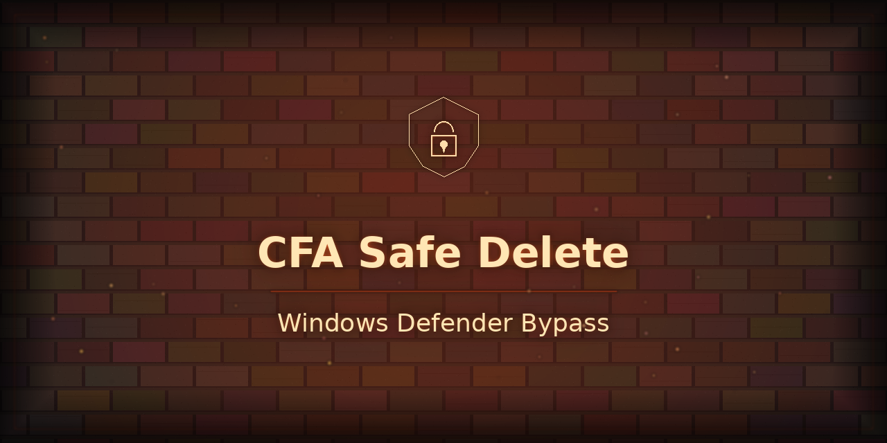

<p align="center"></p>

# cfa-safe-delete

> **Windows Defender Controlled Folder Access (CFA) blocks deletion — even for Administrators.**
> This tool detects it, temporarily disables it, deletes safely, and re-enables it. Cross-platform aware.

---

## The Problem Nobody Warns You About

You try to delete a folder. You get:

```
Access is denied.
```

You've tried everything:
- ✗ `takeown /F` + `icacls /grant Administrators:F /T` — still denied
- ✗ `icacls /reset /T` (nukes ALL ACL entries including DENY) — still denied
- ✗ Killed every locked process, stopped Windows Search — still denied
- ✗ `rmdir /S /Q` with and without `\\?\` long-path prefix — still denied
- ✗ Rebooted with startup tasks running as SYSTEM — still denied

**Root cause: Windows Defender Controlled Folder Access (CFA)** silently blocks modification/deletion of files in protected folders (Documents, Desktop, Pictures, etc.) — even from Admin/SYSTEM — with no meaningful error message. Just "Access is denied."

---

## True Metrics (Real-World Discovery Session)

| Metric | Value |
|--------|-------|
| Folders deleted | 3 (Samsung SmartSwitch, Steam Backup, BFD Drums) |
| Space freed | **280.4 GB** |
| C: free before | 84.4 GB (8.3% free — critically low) |
| C: free after | **364.8 GB (39.2% free)** |
| Diagnostic attempts before finding CFA | **5 failed scripts** |
| Time to diagnose | ~45 minutes |
| Samsung backup folder size | 266.6 GB (267k files, deep nested 8.3 short names) |
| icacls /reset ran on | ~197,000+ files — changed nothing |
| Services stopped before finding root cause | WSearch, Samsung Mobile Connectivity x2 |
| Root cause | Windows Defender Controlled Folder Access = **ENABLED** |

---

## Quick Start (Windows)

```powershell
# Run as Administrator
Set-ExecutionPolicy -Scope Process -ExecutionPolicy Bypass
.\scripts\windows\cfa-safe-delete.ps1 -Path "C:\Users\User\Documents\Samsung"
```

Or delete multiple targets:
```powershell
.\scripts\windows\cfa-safe-delete.ps1 -Path @(
    "C:\Users\User\Documents\Samsung",
    "C:\Users\User\Documents\Steam Backup",
    "C:\Users\User\Documents\BFD Drums"
)
```

**Diagnose + fix in one step (the original script that solved it):**
```powershell
.\scripts\windows\check-and-fix.ps1 -Path "C:\Users\User\Documents\Samsung"
```

**Dry run (diagnose only, no deletion):**
```powershell
.\scripts\windows\check-and-fix.ps1 -Path "C:\Users\User\Documents\Samsung" -WhatIf
.\scripts\windows\diagnose.ps1 -Path "C:\Users\User\Documents\Samsung"
```

---

## How It Works

```
1. Check if Controlled Folder Access is enabled
2. If enabled → temporarily disable (requires Admin)
3. Delete target paths (rmdir /S /Q with \\?\ for long paths)
4. Re-enable CFA regardless of outcome (finally block)
5. Report freed space
```

The key insight: **`/grant` adds an ALLOW rule but DENY still wins. `/reset` wipes ACLs but CFA re-blocks at the kernel level. The only fix is to disable CFA, do the work, re-enable.**

---

## Platform Support

| Platform | Script | Equivalent Protection | Status |
|----------|--------|----------------------|--------|
| Windows 10/11 | `scripts/windows/cfa-safe-delete.ps1` | Controlled Folder Access | ✅ Full support |
| Linux | `scripts/linux/cfa-safe-delete.sh` | AppArmor / immutable flags | ✅ Supported |
| macOS | `scripts/macos/cfa-safe-delete.sh` | TCC / SIP / quarantine flags | ✅ Supported |

---

## Diagnostic Journey (The 5-Attempt Path)

| Attempt | What We Tried | Reasoning | Why It Failed |
|---------|--------------|-----------|---------------|
| 1 | `Remove-Item -Recurse -Force` | Standard PowerShell delete | Path length >260 chars |
| 2 | `cmd /c rmdir /S /Q "\\?\path"` | Bypass MAX_PATH with UNC prefix | Access denied (assumed DENY ACEs) |
| 3 | `takeown /R` + `icacls /grant:r Admins:F /T` | Permissions fix: take ownership + grant full control | Permissions already fine — wrong theory |
| 4 | `icacls /reset /T` + `attrib -R -H -S` | Nuclear ACL wipe + strip read-only | CFA re-blocks at kernel — ACLs irrelevant |
| 5 | Stop Samsung services + WSearch + 3s sleep | File lock theory: process holding handles | Nothing was locked — wrong theory again |
| ✅ **6** | `Get-MpPreference \| EnableControlledFolderAccess` → **ENABLED** → disable → delete → re-enable | Finally checked CFA | **280.4 GB freed instantly** |

> The permissions looked perfect (`BUILTIN\Administrators:(I)(OI)(CI)(F)`).
> No processes were locking the files.
> CFA was silently blocking everything at a layer below ACLs.

---

## Windows Requirements

- Windows 10 1709+ or Windows 11
- PowerShell 5.1+
- Administrator privileges (required to toggle CFA)
- Windows Defender / Microsoft Defender enabled (CFA is a Defender feature)

---

## Safety

- CFA is always re-enabled after deletion — even if deletion fails
- Uses `try/finally` pattern: CFA state is restored on error
- Dry-run mode available: `-WhatIf`
- Verbose mode: `-Verbose`

```powershell
# Dry run — shows what would be deleted without touching anything
.\scripts\windows\cfa-safe-delete.ps1 -Path "C:\BigFolder" -WhatIf
```

---

## Linux Equivalent

Linux doesn't have CFA but has similar blockers:

```bash
# Remove immutable flag (chattr +i)
sudo chattr -R -i /path/to/folder
sudo rm -rf /path/to/folder
```

See `scripts/linux/cfa-safe-delete.sh` for full AppArmor/SELinux handling.

---

## macOS Equivalent

macOS blocks deletions via TCC (Transparency, Consent, Control) and quarantine flags:

```bash
# Remove quarantine flag
xattr -rd com.apple.quarantine /path/to/folder
# Remove extended attributes blocking deletion
xattr -cr /path/to/folder
sudo rm -rf /path/to/folder
```

See `scripts/macos/cfa-safe-delete.sh` for full SIP/TCC handling.

---

## CLAUDE.md

AI assistants working on this repo — see [CLAUDE.md](./CLAUDE.md) for architecture notes, testing protocol, and contribution guidance.

---

## Contributing

See [CONTRIBUTING.md](./CONTRIBUTING.md). PRs welcome — especially:
- Additional Windows Defender edge cases
- macOS TCC improvements
- Linux SELinux / AppArmor profiles
- Additional language ports (Python, Go, Rust)

---

## License

MIT — free to use, modify, distribute. See [LICENSE](./LICENSE).

---

## Author

**Chharith Oeun** ([@BBoy-PopTart](https://github.com/BBoy-PopTart))
Built during a real PC migration: C: 930 GB SSD → new FireCuda 1TB AI drive.
Diagnosed and solved live by Chharbot + Claude.

---

*"It's not a permissions problem. It's not a lock problem. It's Controlled Folder Access."*

---

## Support This Work

If this saved you time, consider buying me a coffee:

[](https://buymeacoffee.com/chharith)
